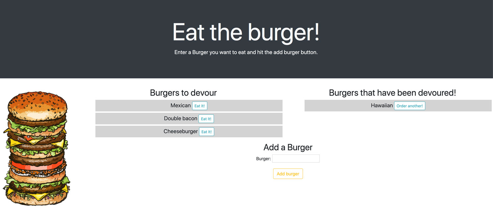

# Burger Logger

<svg xmlns="http://www.w3.org/2000/svg" xmlns:xlink="http://www.w3.org/1999/xlink" width="96" height="20"><linearGradient id="b" x2="0" y2="100%"><stop offset="0" stop-color="#bbb" stop-opacity=".1"/><stop offset="1" stop-opacity=".1"/></linearGradient><clipPath id="a"><rect width="96" height="20" rx="3" fill="#fff"/></clipPath><g clip-path="url(#a)"><path fill="#555" d="M0 0h79v20H0z"/><path fill="#97ca00" d="M79 0h17v20H79z"/><path fill="url(#b)" d="M0 0h96v20H0z"/></g><g fill="#fff" text-anchor="middle" font-family="DejaVu Sans,Verdana,Geneva,sans-serif" font-size="110"> <text x="405" y="150" fill="#010101" fill-opacity=".3" transform="scale(.1)" textLength="690"></text><text x="405" y="140" transform="scale(.1)" textLength="690">Version</text><text x="865" y="150" fill="#010101" fill-opacity=".3" transform="scale(.1)" textLength="70"></text><text x="865" y="140" transform="scale(.1)" textLength="160">1.0</text></g> </svg>

## Description

A burger logger with MySQL, Node, Express, Handlebars and a homemade ORM. Utilising the MVC design pattern; it uses Node and MySQL to query and route data within the app, and Handlebars to generate the HTML.

## Table of Contents

- [Description](#description)
- [Screenshot](#screenshot)
- [Installation](#installation)
- [Usage](#usage)
- [Authors and Acknowledgment](#authors-and-acknowledgment)
- [License](#license)

## Screenshot

## Installation

The application has been deployed on Heroku and is available [here](https://murmuring-springs-41737.herokuapp.com/)

## Usage

- Eat the Burger! is a restaurant app that lets users input the names of burgers they'd like to eat.

- Whenever a user submits a burger's name, the app displays the burger on the left side of the page and is waiting to be devoured.

- Each burger in the waiting area also has a `Eat it!` button. When the user clicks it, the burger will move to the right side of the page.

- Burgers on the right hand side of the page have an `Order Another!` button. When the user clicks it, the burger will move to the left side of the page.

- The app stores every burger in a database, whether devoured or not.

## Authors and Acknowledgment

### Main Author

[DCRevResLabs](https://github.com/DCRevResLabs)

## License

© 2020 Revolution Research Laboratories Pty.Ltd. All Rights Reserved.
